# Задание 18
## Пример задания
***Квадрат разлинован на N×N клеток (1 < N < 17). Исполнитель Робот может перемещаться по клеткам, выполняя за одно перемещение одну из двух команд: вправо или вниз. По команде вправо Робот перемещается в соседнюю правую клетку, по команде вниз – в соседнюю нижнюю. При попытке выхода за границу квадрата Робот разрушается. Перед каждым запуском Робота в каждой клетке квадрата лежит монета достоинством от 1 до 100. Посетив клетку, Робот забирает монету с собой; это также относится к начальной и конечной клетке маршрута Робота. Определите максимальную и минимальную денежную сумму, которую может собрать Робот, пройдя из левой верхней клетки в правую нижнюю. В ответе укажите два числа – сначала максимальную сумму, затем минимальную.***  

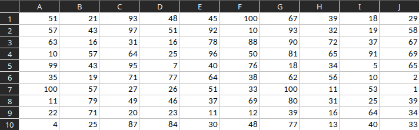

## Порядок действий
- Создать под исходной таблицей ещё одну такого же размера, выделить цветом  

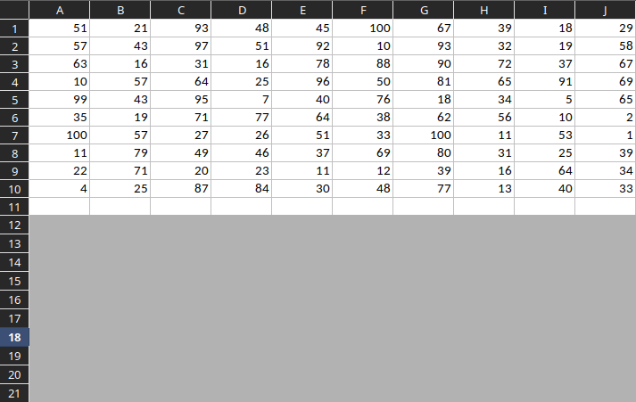  

- В начальную ячейку копии записать то же значение, что и в начальной ячейке исходной таблицы. Крайний столбец заполнить по формуле  

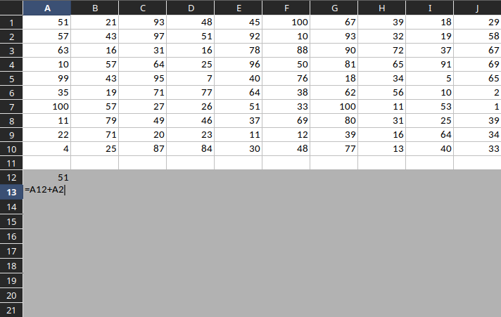  

- Крайнюю строку заполнить по формуле  

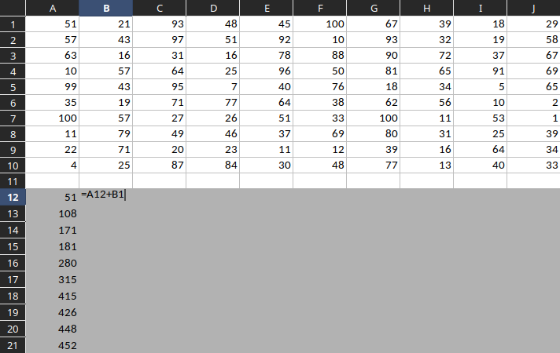  

- Для нахождения максимума оставшуюся часть таблицы заполнить по формуле  

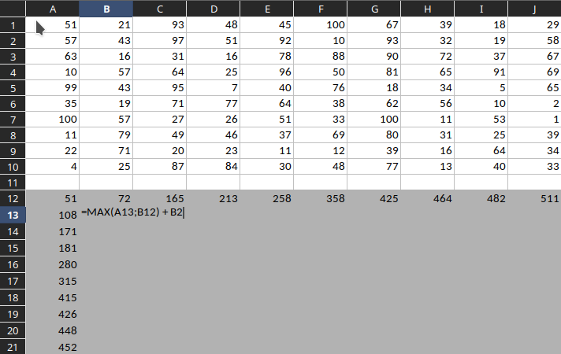  

- Конечный результат. Максимум в конечной ячейке = 1204  

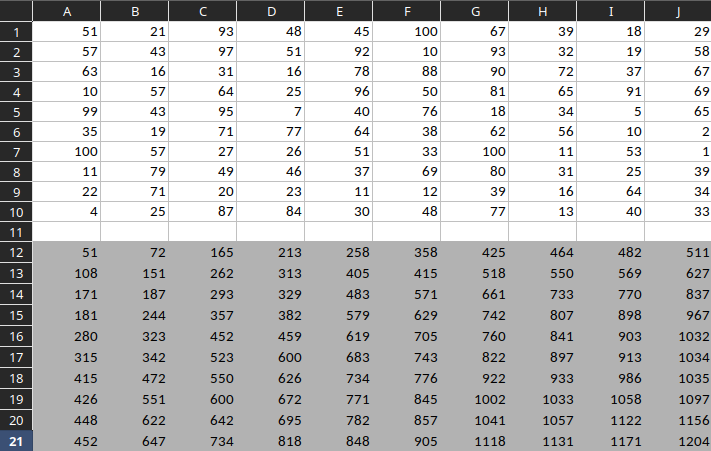  

- Создать ещё одну копию исходной таблицы, выделить цветом. В начальную ячейку копии записать то же значение, что и в начальной ячейке исходной таблицы  

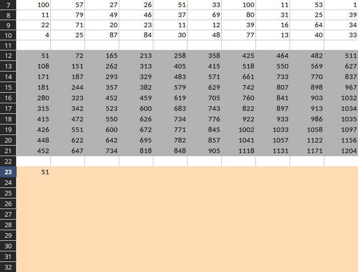  

- Так же как и в предыдущей копии заполнить крайние строку и столбец  

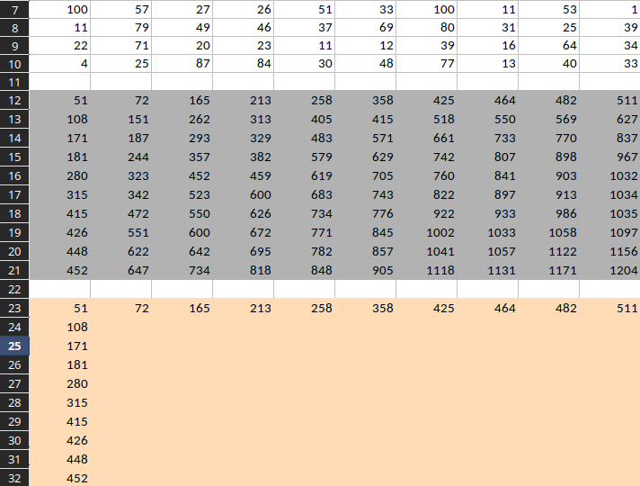  

- Для нахождения минимума оставшуюся часть таблицы заполнить по формуле  

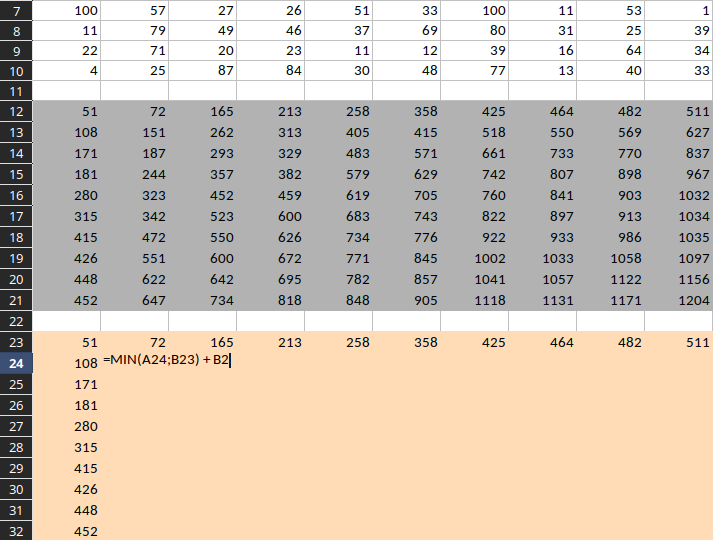  

- Конечный результат. Минимум в конечной ячейке = 502  

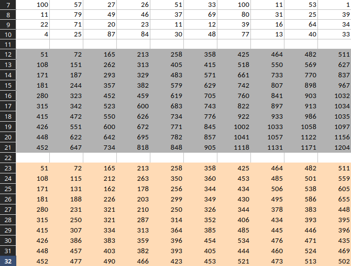  

- Если по условию робот должен пройти через пределённую клетку, то по тем же формулам строим подтаблицу до этой этой клетки включительно и подтаблицу, котрая начинается с этой клетки  

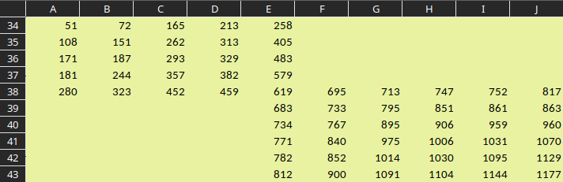  
